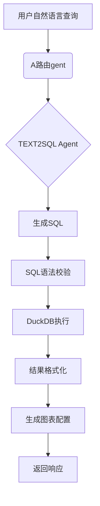

# Kiwi DataAgent方案设计

## 认证机制：

* 使用JWT Bearer Token进行认证

* /auth/login 获取访问令牌

* 所有受保护端点需要Authorization头

## 权限控制流程
数据隔离确保用户只能访问所属项目
* 系统管理员：管理所有资源

* 项目管理员：管理所属项目

* 普通用户：仅限数据查询

使用FastAPI依赖注入实现权限中间件

## 资源组织

* 项目为核心组织单元

* 数据源、数据集、Agent和对话都归属特定项目


## 对话流程

* 创建会话 → 发送消息 → 获取Agent响应 → 提交反馈
* 消息包含生成的SQL、查询结果和可视化配置




## 数据查询优化

使用DuckDB内存引擎加速查询

SQL执行前进行安全校验（防止DROP等危险操作）

查询结果缓存机制

## 扩展性设计

* 数据库层：SQLAlchemy ORM支持多数据库

* Agent类型：通过注册机制支持新Agent类型, Agent配置支持灵活参数

* 数据源连接配置：通用JSON结构适配不同数据源

* 响应格式统一化便于前端处理

## 安全措施

* JWT令牌认证

* 密码bcrypt加密存储

* SQL注入防护

* 数据隔离（项目级权限）

# 错误处理：

* 标准化错误响应格式

* 包含401未授权、404未找到等常见状态码


## API接口设计 (OpenAPI 3.0规范)
* 认证管理
```html
# POST /auth/login
# 请求: { "username": "user1", "password": "pass123" }
# 响应: { "access_token": "jwt_token", "token_type": "bearer" }

# POST /auth/logout
# 头部: Authorization: Bearer <token>

# GET /auth/me
# 响应: { "id": 1, "username": "user1", "roles": ["项目管理员"] }
```
* 项目管理
```html
# POST /projects
# 请求: { "name": "销售分析", "description": "销售数据仪表盘" }
# 响应: 201 Created + 项目ID

# GET /projects
# 响应: [{ "id": 1, "name": "销售分析", "owner": "user1" }]

# GET /projects/{project_id}
# 响应: 项目详情+成员列表
```
* 数据源管理
```html
# POST /projects/{project_id}/data-sources
# 请求: { 
#   "name": "生产数据库",
#   "type": "MySQL",
#   "connection_config": {"host":"db.example.com","port":3306,...}
# }
# 响应: 201 Created + 数据源ID

# GET /projects/{project_id}/data-sources
# 响应: 数据源列表
```
* 数据集管理
```html
# POST /projects/{project_id}/datasets
# 请求: {
#   "name": "销售数据集",
#   "data_source_id": 1,
#   "configuration": {"tables":["sales"], "columns":[...]}
# }
# 响应: 201 Created + 数据集ID

# GET /datasets/{dataset_id}
# 响应: 数据集详情+元数据
```
* Agent管理
```html
# POST /projects/{project_id}/agents
# 请求: {
#   "name": "SQL生成Agent",
#   "type": "TEXT2SQL",
#   "config": {"model":"gpt-4","temperature":0.7}
# }
# 响应: 201 Created + Agent ID
```
* 对话管理
```html
# POST /projects/{project_id}/conversations
# 请求: { "title": "Q3销售分析" }
# 响应: 201 Created + 会话ID

# POST /conversations/{conversation_id}/messages
# 请求: {
#   "content": "显示2023年Q3各产品销量",
#   "agent_id": 1  # 指定使用的Agent
# }
# 响应: {
#   "message_id": 123,
#   "sql": "SELECT ...",  # 生成的SQL
#   "data": [...],        # 查询结果
#   "report": {...}       # 图表配置
# }

# GET /conversations/{conversation_id}/messages
# 响应: 对话历史消息列表
```
* 反馈接口
```html
# POST /messages/{message_id}/feedback
# 请求: { "feedback": 1 }  # 1=喜欢, 0=不喜欢
# 响应: 204 No Content
```
* 权限管理
```html
# POST /projects/{project_id}/members
# 请求: { "user_id": 2, "role_id": 3 }  # 添加成员
# 响应: 201 Created

# DELETE /projects/{project_id}/members/{user_id}
# 响应: 204 No Content
```