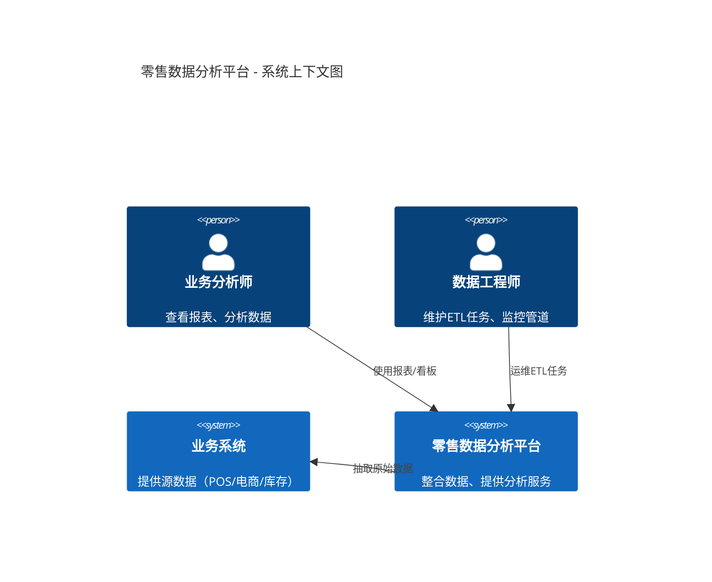
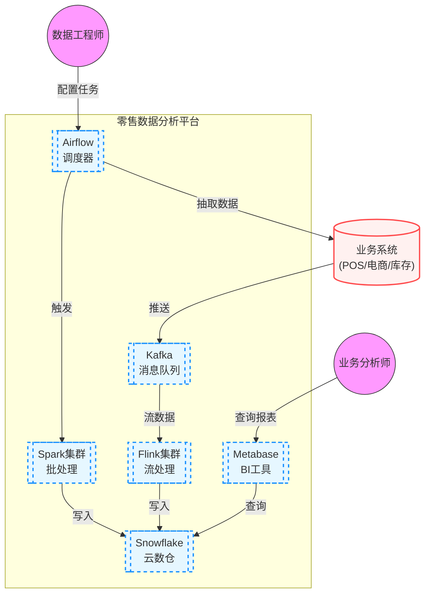
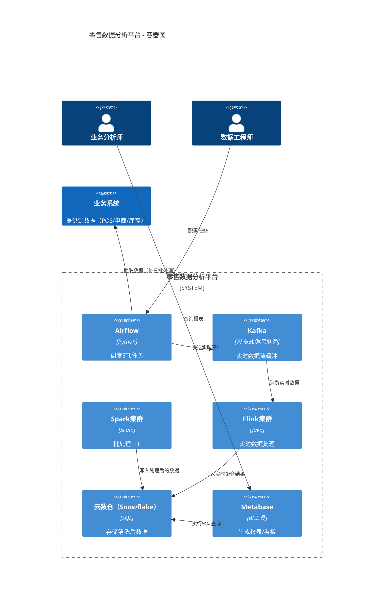
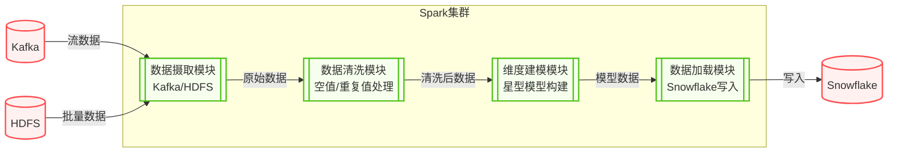
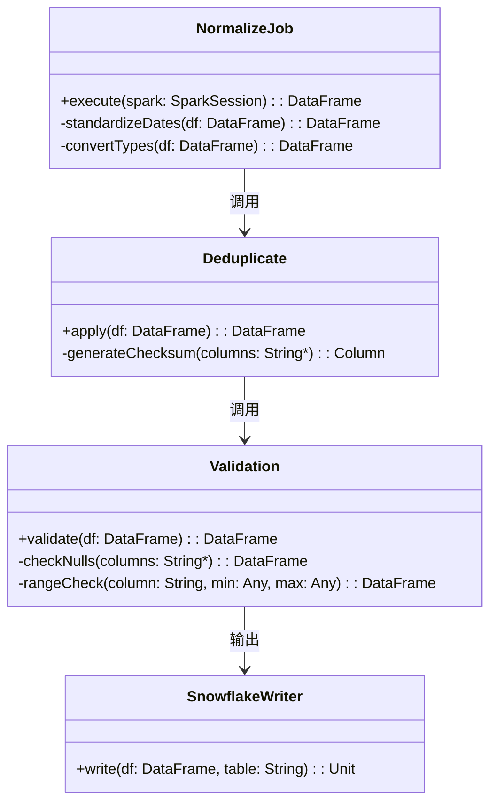
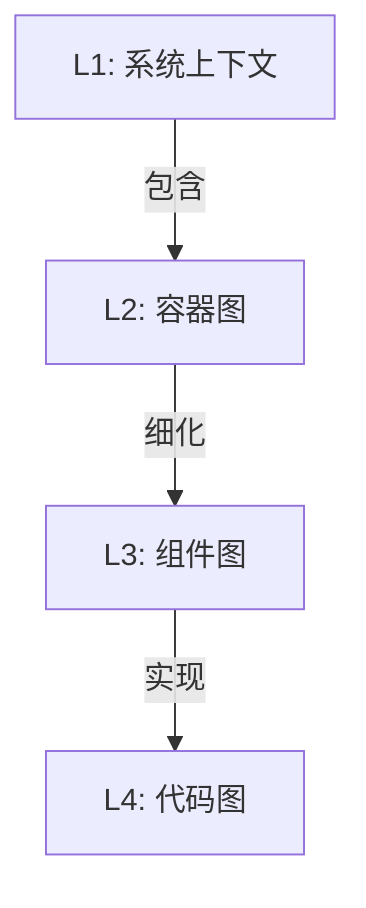

# C4 Model

涵盖四个层级：系统上下文图 → 容器图 → 组件图 → 代码图

---

## 背景：零售数据分析平台

目标：从多个业务系统（POS、电商、库存）抽取数据，进行清洗、加工，最终提供报表和实时看板。

### 层级 1 系统上下文图（System Context Diagram）

作用：描述系统边界和外部依赖（用户、外部系统）。



关键元素：

- 外部角色：业务分析师、数据工程师

- 外部系统：业务系统（数据源）

- 核心系统：零售数据分析平台

关系：谁使用系统、系统依赖谁

### 层级 2：容器图（Container Diagram）

作用：展示系统内部的核心技术组件（容器）及其交互。



关键元素说明：

    容器：蓝色虚线框内为平台核心组件
    
    外部系统：红色边框表示外部依赖
    
    数据流：箭头方向表示数据流动

技术栈：

    Airflow：任务调度
    
    Kafka：实时数据管道
    
    Spark：批处理
    
    Flink：流处理
    
    Snowflake：云数据仓库

Or



关键容器：

- 批处理引擎：Spark（离线清洗）

- 流处理引擎：Flink（实时计算）

- 调度器：Airflow（任务编排）

- 存储层：Snowflake（云数仓）

- 数据出口：Metabase（可视化）

### 层级 3：组件图（Component Diagram）

作用：聚焦单个容器（以 Spark集群 为例）的内部模块。



批处理流程：

- 摄取：从 Kafka（实时）和 HDFS（批量）获取数据

- 清洗：处理缺失值、重复值、格式转换

- 转换：构建事实表/维度表，实现维度建模

- 加载：将处理结果写入 Snowflake 数仓

Or

```mermaid
C4Component
    title Spark批处理容器 - 内部组件图

    Container_Boundary(spark_container, "Spark集群") {
        Component(ingest, "数据摄取模块", "Spark Job", "从Kafka/HDFS读取原始数据")
        Component(clean, "数据清洗模块", "Spark Job", "处理空值/重复值/格式转换")
        Component(transform, "维度建模模块", "Spark Job", "构建星型模型（事实表+维度表）")
        Component(load, "数据加载模块", "Spark Job", "写入Snowflake数仓")
    }

    Rel(ingest, clean, "传递原始数据")
    Rel(clean, transform, "传递清洗后数据")
    Rel(transform, load, "传递模型数据")
    Rel(load, dwh, "写入数仓表")
    Rel_U(kafka, ingest, "消费Kafka数据")
    Rel_U(hdfs, ingest, "读取HDFS文件")
```

关键组件：

- 摄取：对接数据源（Kafka/HDFS）

- 清洗：数据质量处理

- 转换：业务逻辑聚合（如销售事实表）

- 加载：输出到数仓

### 层级 4：代码图（Code Diagram）

作用：描述组件内部的代码结构（以 数据清洗模块 为例）。



核心类说明：

- NormalizeJob：数据标准化

    - 日期格式统一

    - 数据类型转换

- Deduplicate：数据去重

    - 基于主键列的checksum去重

- Validation：数据质量检查

    - 空值检测

    - 值域范围验证

Or

```mermaid
C4Component
    title 数据清洗模块 - 代码结构

Component_Boundary(clean_component, "数据清洗模块") {
Component(normalize, "NormalizeJob.scala", "Spark Job", "标准化字段格式")
Component(dedup, "Deduplicate.scala", "Spark UDF", "去重主键重复数据")
Component(validate, "Validation.scala", "Spark UDF", "检查空值/异常值")
}

Rel(normalize, dedup, "调用UDF")
Rel(dedup, validate, "传递数据")
Rel(validate, load, "输出有效数据")
```

## 数据工程在 C4 中的关键特点

### 层级关联性：



### 明确数据流方向：

上下文图：体现 数据源 → 平台 的依赖

容器图：清晰展示 批处理 vs 流处理 路径

### 工程元素映射表：

| C4 层级 | 数据工程对应元素           |
|:------|:-------------------|
| 系统上下文 | 数据源系统 + 消费方        |
| 容器图   | 数据处理引擎/存储系统        |
| 组件图   | ETL 流水线阶段          |
| 代码图   | Spark/Flink 作业代码结构 |

### 层级穿透：

从业务视角（L1）→ 技术架构（L2）→ 模块设计（L3）→ 实现细节（L4）

突出数据工程特有组件：

消息队列（Kafka）、分布式计算（Spark/Flink）、云数仓（Snowflake）

## 为什么 C4 适合数据系统设计？

- 解决复杂性：数据系统常涉及多技术栈、流批混合架构，C4 的分层抽象能清晰隔离关注点。

- 统一语言：业务方看 L1/L2，开发团队看 L3/L4，避免沟通歧义。

- 技术债务可视化：例如在 L2 容器图中暴露“单点Spark集群”风险，推动升级为多集群。

> 工具实现：以上图表均用 Mermaid 的 C4 语法 绘制，也可用 PlantUML + C4-PlantUML 库（提供更精细控制）。数据工程团队通常将这类图嵌入
> Markdown 文档或数据治理平台。

## 为了便于后续人员的持续维护，请按照如下的结构编写：

```plantuml
'引用格式信息
title 架构图标题
'定义元素
'3rd System
`大数据中台
'主流程
  '数据接入
  '数据处理
  '数据输出
  '数据服务
```