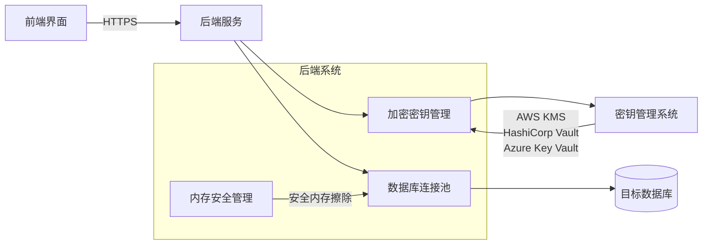

# 数据加密与解密

当使用AES-256加密存储数据源密码后，连接数据库服务时需要安全地解密和使用密码。以下是完整的解决方案：

## 安全密码管理架构



## 步骤：

1. 在存储数据源配置时，使用一个密钥（我们称为加密密钥）对密码进行AES-256加密，然后将加密后的字符串存储到数据库中。
2. 当需要使用数据源连接数据库时，从数据库读取加密的密码，然后用同一个加密密钥解密，得到明文密码。
3. 使用解密后的明文密码建立数据库连接。

### 关键点：

- 加密密钥的安全存储：加密密钥不能硬编码在代码中，也不能存储在数据库中。通常的做法是使用密钥管理服务（如KMS）或者将密钥存储在环境变量/配置文件中（并确保配置文件的安全）。
- 解密过程应在安全的环境中进行（如后端服务器），避免明文密码在网络中传输。

### 具体实现示例（伪代码）：

- 存储密码阶段：
    - 从用户输入获取明文密码：`password_plaintext`
    - 使用加密密钥（encryption_key）和AES-256加密算法加密明文密码，得到密文：`password_ciphertext`
    - 将密文存储到数据源的`password`字段（或配置中的密码字段）
- 连接数据库阶段：
    - 从数据库中取出加密的密码：`password_ciphertext`
    - 使用相同的加密密钥解密，得到明文密码：`password_plaintext`
    - 使用解密后的明文密码去连接数据库

加密过程：

```python
from cryptography.fernet import Fernet
# 生成密钥（注意：这个密钥需要安全保存，一般只生成一次，然后保存在安全的地方）
# key = Fernet.generate_key()  这行代码生成一个密钥，然后我们将这个密钥保存到环境变量中
# 假设我们已经有了密钥，并且存储在环境变量ENCRYPTION_KEY中
import os

key = os.environ['ENCRYPTION_KEY'].encode()  # 环境变量中的密钥
cipher_suite = Fernet(key)


def encrypt_password(password):
    # 输入明文密码，返回加密后的密文（字符串）
    return cipher_suite.encrypt(password.encode()).decode()
# 存储时调用：encrypt_password('mypassword')
```

解密过程：

```python
def decrypt_password(encrypted_password):
    # 输入密文，返回明文密码
    return cipher_suite.decrypt(encrypted_password.encode()).decode()
# 连接数据库时：decrypt_password(从数据库取出的加密密码)
```

## 实现

1. 密码加密存储

```jupyter
from cryptography.fernet import Fernet
import os

# 生成密钥（仅首次运行时执行）
# key = Fernet.generate_key()
# 将密钥存储在安全位置（如KMS或环境变量）

def encrypt_password(password: str) -> str:
    key = os.getenv("ENCRYPTION_KEY").encode()
    cipher_suite = Fernet(key)
    return cipher_suite.encrypt(password.encode()).decode()

# 存储到数据库
encrypted_pwd = encrypt_password("my_db_password")
data_source.connection_config["password"] = encrypted_pwd
data_source.save()
```

2. 安全解密与使用

```jupyter
from contextlib import contextmanager
import psycopg2  # 以PostgreSQL为例

@contextmanager
def secure_db_connection(data_source):
    """安全上下文管理器，确保密码在内存中短暂存在"""
    try:
        # 获取加密密码
        encrypted_pwd = data_source.connection_config["password"]
        
        # 解密密码（在内存中短暂存在）
        key = os.getenv("ENCRYPTION_KEY").encode()
        cipher_suite = Fernet(key)
        password = cipher_suite.decrypt(encrypted_pwd.encode()).decode()
        
        # 创建连接
        conn = psycopg2.connect(
            host=data_source.host,
            port=data_source.port,
            dbname=data_source.database,
            user=data_source.username,
            password=password
        )
        
        # 使用后立即清除内存中的密码
        password = " " * len(password)  # 覆盖内存
        
        yield conn
    finally:
        # 确保连接关闭
        if 'conn' in locals():
            conn.close()
        # 再次清除密码变量
        if 'password' in locals():
            del password
```

3. 在业务中使用安全连接

```jupyter
def execute_sql(data_source_id: int, sql: str):
    data_source = DataSource.objects.get(id=data_source_id)
    
    with secure_db_connection(data_source) as conn:
        cursor = conn.cursor()
        cursor.execute(sql)
        results = cursor.fetchall()
    
    return results
```

## 连接池安全优化

```jupyter
from sqlalchemy import create_engine
from sqlalchemy.pool import QueuePool

class SecureConnectionPool:
    def __init__(self, data_source):
        self.data_source = data_source
        self.engine = None
        
    def get_engine(self):
        if not self.engine:
            # 按需解密密码
            encrypted_pwd = self.data_source.connection_config["password"]
            key = os.getenv("ENCRYPTION_KEY").encode()
            cipher_suite = Fernet(key)
            password = cipher_suite.decrypt(encrypted_pwd.encode()).decode()
            
            # 创建带连接池的引擎
            conn_str = f"postgresql://{self.data_source.username}:{password}@{self.data_source.host}:{self.data_source.port}/{self.data_source.database}"
            self.engine = create_engine(
                conn_str,
                poolclass=QueuePool,
                pool_size=10,
                max_overflow=5,
                pool_recycle=3600
            )
            
            # 立即清除内存中的密码
            secure_erase(password)
        
        return self.engine
```

安全等级矩阵
安全措施 安全等级 实施复杂度 适用场景
环境变量存储密钥 ★★☆ 低 开发/测试环境
KMS服务管理密钥 ★★★ 中 生产环境
Vault动态密钥 ★★★ 高 金融/医疗等高安全要求
内存安全擦除 ★★☆ 中 所有环境
连接池加密 ★★★ 高 高并发生产环境
实施建议
分阶段部署：

阶段1：使用环境变量管理密钥 + 基础加密

阶段2：集成KMS服务 + 内存安全擦除

阶段3：实现动态密钥轮换 + 连接池加密

安全测试：

```python
def test_password_security():
    # 测试密码是否在内存中长期存在
    with mock.patch('module.secure_db_connection') as mock_conn:
        # 执行数据库操作
        result = execute_query(...)

        # 验证密码是否被安全擦除
        assert "password" not in str(inspect.getmembers(mock_conn))
```