# Kiwi企业级DataAgent项目PRD文档

---

## 文档基本信息

- **文档编号**：PRD001
- **产品名称**：Kiwi
- **版本号**：1.1
- **编写人**：kiwi团队
- **编写日期**：2025-07-04
- **审核人**：kiwi团队
- **审核日期**：2025-07-04

## 文档修订记录

| 版本  | 日期         | 修改人    | 修改内容        |
|-----|------------|--------|-------------|
| 1.0 | 2025-07-04 | Kiwi团队 | 初始版本        |
| 1.1 | 2025-07-04 | Kiwi团队 | 增加Agent版本管理 |
| ... | ...        | ...    | ...         |

---

## 1. 项目概述

### 1.1 背景与目的

传统的BI应用构建流程复杂且耗时，Kiwi项目旨在通过DataAgent技术解决以下问题：

- 简化数据探索流程
- 赋能业务人员和数据分析师
- 加速数据洞察与决策支持

Kiwi借助GenAI技术简化数据访问与分析流程。 其数据分析代理（Data Analysis
Agent）支持用户以自然语言提问，系统会自动将这些提问转化为针对数据域(Domain)的精准查询。

**核心目标**： 实现自然语言到数据分析的智能转换，提供端到端的数据洞察解决方案。

### 1.2 功能概览

| 模块      | 功能点             | 描述                       |
|---------|-----------------|--------------------------|
| 用户管理    | 登录/登出           | JWT认证的用户管理系统             |
| 项目管理    | 项目空间            | 创建和管理数据项目                |
| 数据管理    | 数据源管理           | 支持多种数据库连接配置              |
|         | 数据集管理           | 定义和组织数据源中的表/字段           |
| Agent管理 | TEXT2SQL        | 自然语言转SQL的智能Agent         |
|         | RETRIEVAL       | 知识检索智能Agent              |
|         | DATA_ENRICHMENT | 网页信息提取Agent，将非结构化信息转为结构化 |
| 对话系统    | 交互式对话           | 支持历史查询的对话界面              |
|         | 结果反馈            | 用户对结果的喜欢/不喜欢反馈           |
| 权限控制    | RBAC模型          | 系统管理员/项目管理员/数据分析师/普通用户   |

## 2. 详细功能需求

### 2.1 用户认证管理

- **登录功能**：用户名+密码认证; SSO认证
- **登出功能**：安全终止会话
- **用户信息**：获取当前用户信息及角色

### 2.2 项目管理

```mermaid
graph TD
    A[创建项目] --> B[添加成员]
    B --> C[设置角色]
    C --> D[管理项目资源]
```

### 2.3 数据源管理

支持的数据源类型：

- 关系数据库
    - SQLite
    - MySQL
    - PostgreSQL
- 数据仓库
    - Impala
    - Hive
- OLAP引擎
    - DuckDB
    - StarRocks
- 文件服务
    - S3
    - SFTP

连接配置：

```json
{
  "host": "db.example.com",
  "port": 5432,
  "database": "sales",
  "username": "admin",
  "password": "******"
}
```

### 2.4 数据集管理

数据集配置要素：

* 关联数据源
* 表映射关系
* 字段定义
* 数据关系描述

### 2.5 Agent管理系统

| Agent类型         | 功能描述                         | 配置参数                           |
|-----------------|------------------------------|--------------------------------|
| TEXT2SQL        | 自然语言转SQL                     | 模型类型、温度值、最大token数              |
| RETRIEVAL       | 数据检索                         | 检索策略、返回结果数                     |
| DATA_ENRICHMENT | 从各种网络资源中收集信息，将获取的非结构化信息转为结构化 | 设置rearch_topic、定义输出数据的结构、返回结果数 |
| (可扩展)           | 	未来扩展类型                      | 	自定义配置                         |

### 2.6 对话系统

**流程图**


**序列图**

```mermaid
sequenceDiagram
    participant User
    participant Frontend
    participant Backend
    participant Agent
    participant DuckDB
    User ->> Frontend: 输入自然语言查询
    Frontend ->> Backend: POST /conversations/{id}/messages
    Backend ->> Agent: 调用TEXT2SQL Agent
    Agent ->> Backend: 生成SQL语句
    Backend ->> DuckDB: 执行SQL查询
    DuckDB ->> Backend: 返回查询结果
    Backend ->> Agent: 生成图表配置
    Agent ->> Frontend: 返回完整响应
    Frontend ->> User: 展示文字+图表结果
    User ->> Frontend: 提交反馈（可选）
```

反馈选项：

- ✅ 结果正确

- ⚠ 部分正确

- ❌ 完全错误

- 💡 建议改进

### 2.7 权限管理系统

角色权限矩阵：

| 功能      | 系统管理员 | 项目管理员  | 数据分析师  | 普通用户 |
|---------|-------|--------|--------|------|
| 创建项目    | ✓     | ✗      | ✗      | ✗    |
| 删除项目    | ✓     | ✗      | ✗      | ✗    |
| 添加成员    | ✓     | ✓      | ✗      | ✗    |
| 创建数据源   | ✓     | ✓      | ✗      | ✗    |
| 查看数据源   | ✓     | ✓      | ✓      | ✗    |
| 创建数据集   | ✓     | ✓      | ✓      | ✗    |
| 查看数据集   | ✓     | ✓      | ✓      | ✓    |
| 查询数据    | ✓     | ✓      | ✓      | ✓    |
| 管理Agent | ✓     | ✓      | ✗      | ✗    |
| 查看敏感数据  | ✓     | △(需审批) | △(需审批) | ✗    |

✓: 完全权限 △: 仅自己创建的 ✗: 无权限

## 3. 前端界面规范

### 3.1 整体布局

```text
+-----------------------------------+
| Logo | 平台名称 | 帮助 | 用户信息 |
+-----------------+-----------------+
| 左侧菜单        |                 |
| - 对话         |  内容显示区      |
|   - 历史对话    |                 |
| - 配置         |                 |
|   - 成员管理    |                 |
|   - 权限管理    |                 |
|   - 项目管理  |                 |
|   - 数据源管理  |                 |
|   - 数据集管理  |                 |
|   - Agent管理   |                 |
+-----------------+-----------------+
```

### 3.2 关键页面设计

#### 3.2.1 对话界面

```markdown
[对话标题：Q3销售分析]
-----------------------------------
[用户] 2023-07-04 14:30
显示2023年Q3各产品销量

[系统] 2023-07-04 14:31

### 分析结果

2023年第三季度各产品销售情况如下：

[柱状图]
产品A: ￥1,200,000
产品B: ￥980,000
产品C: ￥1,500,000

### 使用的SQL

```sql
SELECT product, SUM(sales) 
FROM sales_data 
WHERE quarter = 'Q3' AND year = 2023 
GROUP BY product
```

[反馈按钮] ✅ 结果正确 ⚠ 部分正确 ❌ 完全错误 💡 建议改进

#### 3.2.2 数据源管理界面

- 数据源列表视图
- 新建数据源表单
- 连接测试功能
- 数据预览功能

### 3.2.3 数据集配置页面

```markdown
[数据集配置向导]
步骤1：选择数据源
☑ MySQL (生产库) [别名: mysql_prod]
☑ PostgreSQL (客户库) [别名: pg_customers]
☐ SQLite (本地缓存)

步骤2：表映射配置
| 源数据源 | 源表名 | 目标表名 | 字段筛选 |
|----------------|----------|-------------|---------------|
| mysql_prod | orders | sales_orders| id,amount,date|
| pg_customers | users | customers | id,name,email |

步骤3：关系配置
[图形化关系编辑区]
orders.cust_id → customers.id
```

## 4. 后端系统设计

### 4.1 系统架构

Kiwi数据智能体架构具备以下特点：

- 运用多个智能体（GenAI 智能体）和嵌入技术（embeddings）来理解用户以自然语言提出的查询。
- 借助领域嵌入、指标与维度元数据嵌入、**维度数据嵌入**，以及关于这些元素的定义信息和所使用术语的分类体系。
- 通过示例和反馈循环不断优化其对查询的理解能力和准确性。
- 将自然语言查询转化为可针对领域（Domain）执行的查询，并利用执行层来获取查询结果。

#### 4.1.2 系统上下文

```mermaid
graph TD
%% 用户角色
    biz_customer["业务用户"] -->|决策支持| Kiwi
    ba_customer["业务分析师"] -->|数据洞察| Kiwi
    admin["数据工程师"] -->|数据源接入/创建数据集| Kiwi
%% 外部系统
    Kiwi["Kiwi数据智能分析平台"] -->|data ingest| DataWarehouse["数据仓库<br>(提供主题数据)"]
    Kiwi -->|data ingest| FilePlatform["对象存储<br>(支持parquet/json/...)"]
    Kiwi -->|data ingest| DatAPI["数据集市<br>OLAP/sqlite/mysql/..."]
```

#### 4.1.3 逻辑架构

#### 4.1.4 技术架构

```mermaid
graph TD
%% ========== 用户角色 ==========
    biz_customer["业务用户"] -->|AI对话/获取洞察| Frontend
    ba_customer["业务分析师"] -->|AI对话/获取洞察| Frontend
    admin["数据工程师"] -->|数据源接入/创建数据集| Frontend
%% ========== 前端系统 ==========
    Frontend["Web前端<br>Vue + H5 + Nginx [+ DuckDB-Wasm]"]
%% ========= 网关 ===========
    Gateway["API网关"]
%% ========== 核心服务容器 ==========
    subgraph Kiwi_Core["Kiwi 核心服务"]
        Backend["后端服务<br>Guicorn + ASGI Uvicorn + FastAPI"]
        Database["业务数据库<br>Sqlite/PostgreSQL"]
        VectorDB["向量数据库<br>Chroma/Milvus"]
        LangchainService["Agent服务<br>LLM + LangChain"]
        DuckDB["DuckDB 分析引擎<br>（嵌入式联邦查询）"]
    end

%% ========== 数据流连接 ==========
    Frontend --> Gateway
    Gateway --> Backend
    Backend --> Database
    Backend --> VectorDB
    Backend --> LangchainService
    LangchainService --> DuckDB
%% ========== 外部系统集成 ==========
    DuckDB --> DataWarehouse["数据仓库<br>Hive/OLAP"]
    DuckDB --> FilePlatform["对象存储<br>S3/OSS"]
    DuckDB --> rdbms["OLAP引擎<br>StarRocks/Doris/Clickhouse"]
%% ========== 联邦查询示意 ==========
    DuckDB -.->|联邦查询| ExternalDB["RDBMS"]
%% ========== 图例说明 ==========
    classDef external fill: #f9f, stroke: #333, stroke-dasharray: 5 5
    classDef core fill: #e6f7ff, stroke: #1890ff
    classDef db fill: #f6ffed, stroke: #52c41a
    class Kiwi_Core core
class DataWarehouse,FilePlatform,rdbms,ExternalDB external
class Database,VectorDB db
```

- FastAPI + Uvicorn 提供高性能异步 API
- Gunicorn 负责多进程管理，提高并发
- Nginx 反向代理，支持负载均衡 & HTTPS

#### 4.1.5 组件图

```mermaid
graph TD
    subgraph "Web前端"
        Dashboard["问数"]
        DatasetManager["数据集管理UI"]
    end

    subgraph "网关服务-南北"
        AuthAPI["认证授权模块"]
    end

    subgraph "后端API服务"
        LLMOrchestrator["Agent协调器"]
        Text2SQL["Text2SQL"]
        QueryEngine["DuckDB联邦查询引擎"]
    end

    subgraph "外部数据源"
        DataWarehouse["数据仓库"]
        FilePlatform["文件服务"]
        Database["关系数据库"]
    end

    subgraph "SQLAgent"
        SQL_START("START")
        SQL_Agent["LLM + Prompt"]
        DBTools["ToolCall"]
        SQL_END("END")
    end

    subgraph "RetrievalAgent"
        Retrieval_Start["START"]
        Generate_Query["generate_query"]
        Retrieve["Retrieve"]
        Response["LLM + Prompt"]
        VectorDB["VectorDB"]
        Retrieval_End["END"]
    end

%% 数据流
    Dashboard -->|API调用| AuthAPI
    AuthAPI --> Text2SQL
    QueryEngine --> DataWarehouse
    QueryEngine --> FilePlatform
    QueryEngine --> Database
    Text2SQL --> LLMOrchestrator
    LLMOrchestrator --> QueryEngine
    LLMOrchestrator --> SQL_Agent
    SQL_START --> SQL_Agent --> DBTools
    DBTools --> SQL_Agent
    SQL_Agent --> SQL_END
    LLMOrchestrator --> Generate_Query
    Retrieval_Start --> Generate_Query
    Generate_Query --> Retrieve
    Retrieve --> VectorDB
    Retrieve --> Response
    Response --> Retrieval_End
```

##### 数据集配置工作流

```mermaid
flowchart TB
    A[开始] --> B[选择数据集]
    B --> C[添加数据源]
    C --> D{设置别名}
    D --> E[配置表映射]
    E --> F[定义关系]
    F --> G[保存配置]
    G --> H[结束]
```

```mermaid
graph TD
    DS1[数据集1] -->|别名: db1| MySQL_A
    DS1 -->|别名: db2| MySQL_B
    DS2[数据集2] -->|别名: db1| PostgreSQL
    DS2 -->|别名: db2| MySQL_A
```

- 不同数据集可以使用相同别名指向不同数据源

- 同一数据源在不同数据集可以使用不同别名

##### Agent管理流程：

##### DuckDB联邦查询扩展数据源：

```mermaid
graph LR
    DuckDB -->|ATTACH| MySQL
    DuckDB -->|ATTACH| PostgreSQL
    DuckDB -->|ATTACH| SQLite
    DuckDB -->|ATTACH| DuckDBFile["duckdb database file"]
    DuckDB -->|HTTPFS| S3["对象存储,S3,..."]
    DuckDB -->|HTTPFS| File[远程文件,parquet,avro,excel,csv]
    DuckDB -->|Register| DataFrame["pandas DataFrame"]
```

DuckDB联邦查询流程：

```mermaid
sequenceDiagram
    participant User
    participant Backend
    participant DuckDB
    User ->> Backend: 登陆
    Backend ->> Backend: 创建Session
    User ->> Backend: 执行查询请求
    Backend ->> Backend: 获取查询数据集信息
    Backend ->> DuckDB: 实例初始化，并加载数据集
    DuckDB ->> DuckDB: ATTACH 'host= user= port=0 database=mysql' AS ${ds1_alise} (TYPE mysql, READ_ONLY);
    DuckDB ->> DuckDB: ATTACH '' AS ${ds2_alise} (TYPE postgres, READ_ONLY);
    DuckDB ->> DuckDB: CREATE VIEW sales_orders AS SELECT * FROM ${ds1_alise}.orders
    DuckDB ->> DuckDB: CREATE VIEW customers AS SELECT * FROM ${ds2_alise}.users
    Backend ->> DuckDB: EXECUTE federated_query
    DuckDB ->> Backend: 返回结果
    Backend ->> User: 格式化为图表+文本
```

- 创建session，创建map,记录数据集与duckdb实例关系
- 查看数据集对应的duckdb实例是否存在，不存在创建一个新的duckdb实例
- duckdb实例初始化，加载数据集中的数据库与表
    - Non-Materialization Attach方式访问远程数据库
    - Materialization： 创建内存表，将远程数据库表数据同步到duckdb实例内存中

> 注意： 确保在duckdb实例中数据库名称唯一

##### 权限控制流程

**数据集权限控制**

```mermaid
graph TD
    A[查询请求] --> B{用户有数据集权限}
    B -->|是| C{检查各数据源权限}
    C -->|全部通过| D[执行联邦查询]
    C -->|拒绝| E[返回权限错误]
    B -->|否| F[返回权限错误]
```

#### 4.1.6 代码图

##### API接口


##### 联邦查询引擎

部分代码（Pseudo）:

```text
class FederatedQueryEngine:
    def execute(self, dataset_id: int, sql: str):
        # 获取数据集配置
        dataset = get_dataset(dataset_id)
        
        # 获取关联数据源
        data_sources = get_dataset_sources(dataset_id)
        
        # 创建DuckDB连接
        conn = duckdb.connect()
        
        # 附加所有数据源
        for ds in data_sources:
            conn.execute(f"""
                ATTACH '{self._build_connection_string(ds)}' 
                AS {ds.alias} (TYPE {ds.type})
            """)
        
        # 创建表映射视图
        for mapping in dataset.config["table_mappings"]:
            conn.execute(f"""
                CREATE VIEW {mapping['target_name']} AS 
                SELECT * FROM {mapping['source_alias']}.{mapping['source_table']}
            """)
        
        # 执行查询
        return conn.execute(sql).fetchdf()
    
    def _build_connection_string(self, data_source):
        config = json.loads(data_source.connection_config)
        if data_source.type == "mysql":
            return f"mysql://{config['user']}:{config['password']}@{config['host']}:{config['port']}/{config['database']}"
        # 其他数据库类型处理...
```

##### 权限检验

数据集权限验证部分代码（Pseudo）

```text
def check_query_permission(user, dataset_id, sql):
    # 1. 验证数据集权限
    if not has_dataset_access(user, dataset_id):
        raise PermissionDenied("No dataset access")
    
    # 2. 获取数据集关联的所有数据源
    data_sources = get_dataset_sources(dataset_id)
    
    # 3. 解析SQL中使用的表
    used_tables = parse_sql_tables(sql)
    
    # 4. 验证每个表对应的数据源权限
    for table in used_tables:
        ds_alias = table.split('.')[0]  # 从db.table中提取别名
        data_source = next(ds for ds in data_sources if ds.alias == ds_alias)
        
        if not has_data_source_access(user, data_source.id):
            # 权限不足时进行脱敏处理
            sql = apply_data_masking(sql, table)
    
    return sql
```

### 4.2 核心API概览

#### 认证管理

| 端点           | 方法   | 功能       |
|--------------|------|----------|
| /auth/login  | POST | 用户登录     |
| /auth/logout | POST | 用户登出     |
| /auth/me     | GET  | 获取当前用户信息 |

#### 项目管理

| 端点                     | 方法   | 功能     |
|------------------------|------|--------|
| /projects              | POST | 创建新项目  |
| /projects              | GET  | 获取项目列表 |
| /projects/{project_id} | GET  | 获取项目详情 |

#### 权限管理

| 端点                                       | 方法     | 功能     |
|------------------------------------------|--------|--------|
| /projects/{project_id}/members           | POST   | 添加成员   |
| /projects/{project_id}/members           | GET    | 获取成员信息 |
| /projects/{project_id}/members/{user_id} | DELETE | 删除成员   |

#### 数据管理

| 端点                                  | 方法   | 功能      |
|-------------------------------------|------|---------|
| /projects/{project_id}/data-sources | POST | 创建数据源   |
| /projects/{project_id}/data-sources | GET  | 获取数据源详情 |
| /projects/{project_id}/datasets     | POST | 创建数据集   |
| /datasets/{dataset_id}              | GET  | 获取数据集详情 |

#### Agent管理

| 端点                                      | 方法   | 功能      |
|-----------------------------------------|------|---------|
| /projects/{project_id}/agents           | POST | 创建Agent |
| /agents/{agent_id}/rollback?version=1.2 | POST | 创建Agent |

#### 对话系统

| 端点                                        | 方法   | 功能     |
|-------------------------------------------|------|--------|
| /projects/{project_id}/conversations      | POST | 创建新对话  |
| /conversations/{conversation_id}/messages | POST | 发送消息   |
| /conversations/{conversation_id}/messages | GET  | 获取历史消息 |
| /messages/{conversation_id}/feedback      | POST | 提交反馈   |

### 4.3 数据库设计

#### E-R图

```mermaid
erDiagram
    USER ||--o{ USER_ROLE: "分配"
    ROLE ||--o{ USER_ROLE: "属于"
    USER ||--o{ PROJECT: "创建"
    PROJECT ||--o{ PROJECT_MEMBER: "拥有成员"
    USER ||--o{ PROJECT_MEMBER: "属于"
    ROLE ||--o{ PROJECT_MEMBER: "具有角色"
    PROJECT ||--o{ DATA_SOURCE: "包含"
    DATA_SOURCE ||--o{ DATASET_DATA_SOURCE: "引用"
    DATASET ||--o{ DATASET_DATA_SOURCE: "包含"
    PROJECT ||--o{ DATASET: "包含"
    PROJECT ||--o{ AGENT: "包含"
    PROJECT ||--o{ CONVERSATION: "包含"
    USER ||--o{ CONVERSATION: "发起"
    CONVERSATION ||--o{ MESSAGE: "包含"
    USER ||--o{ MESSAGE: "创建"
    AGENT ||--o{ MESSAGE: "生成"
    AGENT ||--o{ AGENT_VERSION: "保存"
    AGENT_VERSION ||--o{ AGENT_METRIC: "记录"
```

##### 表关系说明

**用户与角色关系：**

- 多对多关系（USER ⇄ ROLE）

- 通过USER_ROLE关联表实现

**项目结构：**


**项目成员关系：**

- 项目与用户多对多关系
- 通过PROJECT_MEMBER表管理
- 每个成员在项目中有一个角色

**数据集与数据源关系：**

- 多对多关系
- 通过DATASET_DATA_SOURCE表管理

**对话系统关系：**


#### 关键表结构

##### 用户表 (user)

| 字段                 | 类型           | 描述   | 约束                        |
|:-------------------|:-------------|:-----|:--------------------------|
| id                 | INTEGER      | 主键   | PK, AI                    |
| username           | VARCHAR(50)  | 用户名  | UNIQUE, NOT NULL          |
| encrypted_password | VARCHAR(128) | 密码哈希 | NOT NULL                  |
| email              | VARCHAR(100) | 邮箱   |                           |
| is_active          | BOOLEAN      | 是否激活 | DEFAULT 1                 |
| created_at         | TIMESTAMP    | 创建时间 | DEFAULT CURRENT_TIMESTAMP |
| updated_at         | TIMESTAMP    | 更新时间 | DEFAULT CURRENT_TIMESTAMP |

##### 角色表 (role)

| 字段          | 类型      | 描述                                    | 约束               |
|:------------|:--------|:--------------------------------------|:-----------------|
| id          | INTEGER | 主键                                    | PK, AI           |
| code        | INTEGER | 角色代码, 0=系统管理员,1=项目管理员,2=数据分析师,99=普通用户 | UNIQUE, NOT NULL |
| description | TEXT    | 角色描述                                  |                  |

##### 用户角色关联表 (user_role)

| 字段      | 类型      | 描述   | 约束                      |
|:--------|:--------|:-----|:------------------------|
| user_id | INTEGER | 用户ID | FK → user(id), NOT NULL |
| role_id | INTEGER | 角色ID | FK → role(id), NOT NULL |
|         |         |      | PK (user_id, role_id)   |

##### 项目表 (project)

| 字段          | 类型           | 描述    | 约束                        |
|:------------|:-------------|:------|:--------------------------|
| id          | INTEGER      | 主键    | PK, AI                    |
| name        | VARCHAR(100) | 项目名称  | NOT NULL                  |
| description | TEXT         | 项目描述  |                           |
| owner_id    | INTEGER      | 所有者ID | FK → user(id)             |
| created_at  | TIMESTAMP    | 创建时间  | DEFAULT CURRENT_TIMESTAMP |
| updated_at  | TIMESTAMP    | 更新时间  | DEFAULT CURRENT_TIMESTAMP |

##### 数据源表 (data_source)

| 字段                | 类型           | 描述         | 约束                        |
|:------------------|:-------------|:-----------|:--------------------------|
| id                | INTEGER      | 主键         | PK, AI                    |
| project_id        | INTEGER      | 所属项目ID     | FK → project(id)          |
| name              | VARCHAR(100) | 数据源名称      | NOT NULL                  |
| type              | VARCHAR(20)  | 数据库类型      | NOT NULL                  |
| connection_config | TEXT         | 连接配置(JSON) | NOT NULL                  |
| created_by        | INTEGER      | 创建者ID      | FK → user(id)             |
| created_at        | TIMESTAMP    | 创建时间       | DEFAULT CURRENT_TIMESTAMP |
| updated_at        | TIMESTAMP    | 更新时间       | DEFAULT CURRENT_TIMESTAMP |

##### 数据集表 (dataset)

| 字段            | 类型           | 描述          | 约束                        |
|:--------------|:-------------|:------------|:--------------------------|
| id            | INTEGER      | 主键          | PK, AI                    |
| project_id    | INTEGER      | 所属项目ID      | FK → project(id)          |
| name          | VARCHAR(100) | 数据集名称       | NOT NULL                  |
| configuration | TEXT         | 数据集配置(JSON) | NOT NULL                  |
| created_by    | INTEGER      | 创建者ID       | FK → user(id)             |
| created_at    | TIMESTAMP    | 创建时间        | DEFAULT CURRENT_TIMESTAMP |
| updated_at    | TIMESTAMP    | 更新时间        | DEFAULT CURRENT_TIMESTAMP |

configuration样例

```json
{
  "tables": [
    {
      "source_id": 1,
      // 此处的source_id由关联表提供，这里记录每个表所属的数据源
      "table_name": "orders",
      "columns": [
        "id",
        "user_id",
        "amount"
      ]
    },
    {
      "source_id": 2,
      "table_name": "users",
      "columns": [
        "id",
        "name",
        "email"
      ]
    }
  ],
  "table_mappings": [
    {
      "source_alias": "mysql_orders",
      // 对应DATASET_DATA_SOURCE.alias
      "source_table": "orders",
      "target_name": "sales_orders"
      // 数据集内表名
    },
    {
      "source_alias": "pg_customers",
      "source_table": "users",
      "target_name": "customers"
    }
  ],
  "relationships": [
    {
      "left_table": "sales_orders",
      "left_column": "user_id",
      "right_table": "customers",
      "right_column": "id",
      "type": "one-to-many"
    }
  ]
}

```

##### 数据集数据源表(dataset_data_source)

| 字段             | 类型           | 描述    | 约束                     |
|:---------------|:-------------|:------|:-----------------------|
| dataset_id     | INTEGER      | 数据集ID | FK → dataset(id)       |
| data_source_id | INTEGER      | 数据源ID | FK → data_source(id)   |
| alias          | VARCHAR(100) | 数据源别名 | UNIQUE, NOT NULL       |
|                |              |       | PK (dataset_id, alias) |

增加数据源别名，

1. **解决多数据源同名冲突**
    - 当多个数据源中存在相同表名（如`users`）时，在联邦查询中直接使用表名会产生冲突
    - 别名允许为每个数据源分配唯一标识符，例如：`mysql_prod.users`, `pg_backup.users`

2. **简化数据集配置**
    - 在数据集的表映射配置中，通过别名引用数据源比使用数据源ID更直观
    - 别名在配置中更易读且稳定（即使数据源ID变化，别名可保持不变）
3. **支持数据源替换**
    - 当需要切换数据源（如从测试库切到生产库）时，只需修改DATASET_DATA_SOURCE中数据源的指向，而数据集配置无需改变（因为别名保持不变）
4. **查询可读性提升**\
    - 在生成的SQL中使用别名更清晰：
   ```sql
   SELECT * FROM mysql_prod.orders 
   JOIN pg_backup.users ON ...
   ```
5. **权限隔离**：
    - 别名可作为安全层，隐藏真实数据源信息

**别名管理规则**

1. **唯一性约束**： 确保在同一个数据集内别名唯一
2. **默认别名生成**：

- 创建时自动生成（若未提供）：

   ```python
   def generate_alias(data_source_name):
    return f"ds_{sanitize_name(data_source_name)}_{short_uuid()}"
   ```

3. **修改限制**
    - 别名创建后不允许修改（避免影响已配置的数据集）
    - 如需变更，需先解除所有数据集的关联

##### Agent表 (agent)

| 字段         | 类型           | 描述         | 约束                        |
|:-----------|:-------------|:-----------|:--------------------------|
| id         | INTEGER      | 主键         | PK, AI                    |
| project_id | INTEGER      | 所属项目ID     | FK → project(id)          |
| name       | VARCHAR(100) | Agent名称    | NOT NULL                  |
| type       | VARCHAR(20)  | Agent类型    | NOT NULL                  |
| config     | TEXT         | 配置参数(JSON) | NOT NULL                  |
| created_by | INTEGER      | 创建者ID      | FK → user(id)             |
| created_at | TIMESTAMP    | 创建时间       | DEFAULT CURRENT_TIMESTAMP |
| updated_at | TIMESTAMP    | 更新时间       | DEFAULT CURRENT_TIMESTAMP |

##### Agent 版本表 (agent_version)

| 字段         | 类型        | 描述       | 约束             |
|:-----------|:----------|:---------|:---------------|
| id         | INTEGER   | 主键       | PK             |
| agent_id   | INTEGER   | Agent ID | FK → agent(id) |
| config     | TEXT      | 配置信息     | NOT NULL       |
| created_at | TIMESTAMP | 创建时间     |                |

##### Agent 指标表 (agent_metric)

| 字段                 | 类型        | 描述       | 约束                     |
|:-------------------|:----------|:---------|:-----------------------|
| id                 | INTEGER   | 主键       | PK                     |
| agent_version_id   | INTEGER   | Agent ID | FK → agent_version(id) |
| sql_gen_latency    | FLOAT     | sql生成延时  | NOT NULL               |
| query_success_rate | FLOAT     | 查询成功率    | NOT NULL               |
| created_at         | TIMESTAMP | 创建时间     |                        |

##### 对话表 (conversation)

| 字段         | 类型           | 描述     | 约束                        |
|:-----------|:-------------|:-------|:--------------------------|
| id         | INTEGER      | 主键     | PK, AI                    |
| project_id | INTEGER      | 所属项目ID | FK → project(id)          |
| user_id    | INTEGER      | 用户ID   | FK → user(id)             |
| title      | VARCHAR(200) | 对话标题   | NOT NULL                  |
| created_at | TIMESTAMP    | 创建时间   | DEFAULT CURRENT_TIMESTAMP |
| updated_at | TIMESTAMP    | 更新时间   | DEFAULT CURRENT_TIMESTAMP |

##### 消息表 (message)

| 字段              | 类型          | 描述         | 约束                             |
|:----------------|:------------|:-----------|:-------------------------------|
| id              | INTEGER     | 主键         | PK, AI                         |
| conversation_id | INTEGER     | 对话ID       | FK → conversation(id)          |
| content         | TEXT        | 消息内容       | NOT NULL                       |
| role            | VARCHAR(10) | 角色         | user/assistant                 |
| sql_query       | TEXT        | 执行的SQL     |                                |
| report_data     | TEXT        | 图表数据(JSON) |                                |
| feedback_type   | INTEGER     | 用户反馈       | 1=结果正确, 0=完全错误, 2=部分正确, 3=建议改进 |
| feedback_text   | TEXT        | 改进建议       | CHECK(feedback_type=3)         |
| created_at      | TIMESTAMP   | 创建时间       | DEFAULT CURRENT_TIMESTAMP      |
| updated_at      | TIMESTAMP   | 更新时间       | DEFAULT CURRENT_TIMESTAMP      |

##### 项目成员表 (project_member)

| 字段         | 类型      | 描述   | 约束                       |
|:-----------|:--------|:-----|:-------------------------|
| project_id | INTEGER | 项目ID | FK → project(id)         |
| user_id    | INTEGER | 用户ID | FK → user(id)            |
| role_id    | INTEGER | 角色ID | FK → role(id)            |
|            |         |      | PK (project_id, user_id) |

#### 数据流

```mermaid
graph TD
    U[用户] -->|发起查询| C(对话会话)
    C -->|包含| M1(用户消息)
    M1 -->|触发| A(Text2SQL Agent)
    A -->|生成| M2(系统消息)
    M2 -->|包含| S[SQL查询]
    S -->|执行| D[(数据源)]
    D -->|返回| R[查询结果]
    R -->|生成| V[可视化图表]
    V -->|保存| M2
```

#### 表索引设计

##### 高频查询字段

```sql
CREATE INDEX idx_message_conversation ON message(conversation_id);
CREATE INDEX idx_message_feedback ON message(feedback);
CREATE INDEX idx_project_owner ON project(owner_id);
CREATE INDEX idx_dataset_project ON dataset(project_id);
CREATE INDEX idx_conversation_user ON conversation(user_id);
```

##### 外键索引

```sql
CREATE INDEX fk_data_source_project ON data_source(project_id);
CREATE INDEX fk_conversation_project ON conversation(project_id);
```

#### 数据生命周期

```mermaid
gantt
    title 数据生命周期管理
    dateFormat YYYY-MM-DD
    section 项目数据
        创建项目: active, proj1, 2025-07-01, 1d
        活跃使用: proj2, after proj1, 30d
        归档: proj3, after proj2, 1d

    section 对话数据
        新对话: active, conv1, 2025-07-05, 1d
        活跃对话: conv2, after conv1, 7d
        历史对话: conv3, after conv2, 90d
        自动清理: conv4, after conv3, 1d
```

### 4.4 监控指标

#### Agent监控指标

- SQL生成耗时

- 查询成功率

- 结果准确率

## 5. 非功能性需求

### 5.1 性能指标

| 指标      | 目标值  | 测量方式  |
|---------|------|-------|
| SQL生成延迟 | < 3s | 95百分位 |
| 查询执行时间  | < 5s | 平均响应  |
| 并发用户支持  | 100+ | 压力测试  |

### 5.2 安全要求

#### 方案

```mermaid
graph TD
    A[用户请求] --> B[JWT认证]
    B --> C[RBAC权限校验]
    C --> D[SQL安全过滤器]
    D -->|安全| E[执行查询]
    D -->|危险| F[阻断并告警]
    E --> G[数据脱敏处理]
    G --> H[返回结果]
```

#### 数据加密：

- **传输层**：HTTPS
- **存储层**：敏感字段加密
    - 用户密码使用AES-256加密存储
    - 数据源配置中的密码明文显示在JSON示例中，需使用AES-256加密存储
    - 将密钥存储在环境变量/配置文件中（并确保配置文件的安全）

#### 数据脱敏：

- 定义敏感字段, 身份证/银行卡/手机号
- 确定敏感字段脱敏规则
- 确保敏感字段经过脱敏后输出

```sqlite
CREATE TABLE data_masking_rules (
    id INTEGER PRIMARY KEY,
    field_pattern VARCHAR(100) PRIMARY KEY,
    mask_type TEXT CHECK (status IN ('partial', 'hash', 'full')),
    template VARCHAR(200)  -- 如 "****-****-####-{{last4}}"
);
```

敏感字段审批流程

```mermaid
sequenceDiagram
    User ->>+ ApprovalService: 敏感数据访问申请
    ApprovalService ->> Admin: 发送审批通知
    Admin ->> ApprovalService: 审批决定
    ApprovalService ->> RBAC: 添加临时权限
    Note over RBAC: 有效期2小时
```

#### 访问控制：

- JWT令牌有效期：30分钟
- RBAC权限验证

#### SQL安全：

```python
BLACKLIST = ["DROP", "DELETE", "TRUNCATE", "ALTER", "GRANT"]
WHITELIST = ["SELECT", "WITH", "SHOW"]


def validate_sql(sql: str):
    if any(cmd in sql.upper() for cmd in BLACKLIST):
        raise SecurityException("危险操作被拒绝")
```

> SQL注入防护不足，后期增加AST解析校验

#### 审计日志：

- 添加操作审计表，记录关键操作(如数据源配置修改、权限变更)

```sql
CREATE TABLE audit_log (
    operator_id BIGINT,
    action VARCHAR(20),  -- CREATE/UPDATE/DELETE
    target_type VARCHAR(30),  -- DATASOURCE/AGENT
    old_value JSONB,
    new_value JSONB,
    ip_address INET
);
```

### 5.3 可靠性

基于高可用原则，单点故障不影响服务正常提供

#### 关键操作事务处理：

```python
with db.transaction():
    create_message()
    update_conversation()
    log_activity()
```

#### 错误处理机制：

- **SQL执行失败重试**

- **Agent故障转移**

### 5.4 可扩展

负载过高时，支持节点横向扩展，服务能力随着节点数量增加而增强

### 6. 附录

#### 6.1 术语表

| 术语        | 定义               |
|-----------|------------------|
| DataAgent | 数据智能代理，核心处理引擎    |
| TEXT2SQL  | 自然语言转SQL的Agent类型 |
| DuckDB    | 嵌入式分析数据库引擎       |
| RBAC      | 基于角色的访问控制        |

#### 6.2 参考资料

- OpenAPI 3.0规范文档
- FastAPI官方文档
- Langchain框架文档

#### 6.3 版本历史

| 版本  | 日期         | 作者     | 备注   |
|-----|------------|--------|------|
| 1.0 | 2025-07-04 | Kiwi团队 | 初始版本 |
